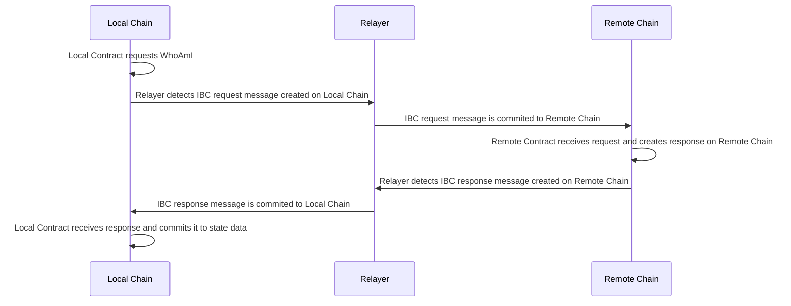

# IBC Smart Contracts Overview

This project demonstrates how to implement and configure IBC Smart Contracts and a Relayer that will transfer the IBC Packets
between them.

**For greater detail into the IBC Protocol, check out the [developer resources](https://tutorials.cosmos.network/academy/3-ibc/1-what-is-ibc.html)**

### Project layout

In order to test out the IBC protocol with smart contracts, we need two chains running. We will call them `local chain` and
`remote chain`. Each of these chains will host a contract that is designed specifically for it. These contracts 
are [local contract](local) and [remote contract](remote) respectively.

In this scenario, a [relayer](relayer) with correct configuration is required in order for IBC messages to be transmitted between the two chains.

There are several scripts in each contract and relayer projects that will do the heavy lifting of configuring and running 
the host chains, storing and instantiating the contracts, configuring and running the relayer, and executing IBC messages and querying the `local contract`.

### Workflow

Follow these steps to run the end-to-end IBC smart contract example. It is easiest to use 5 terminals.

#### 1. [start the local chain](local/scripts/setup_local_chain.sh) (terminal 1)
#### 2. [store and initialize](local/scripts/store_and_init_local_contract.sh) the `local contract` (terminal 2)
#### 3. [start the remote chain](remote/scripts/setup_remote_chain.sh) (terminal 3)
#### 4. [store and initialize](remote/scripts/store_and_init_remote_contract.sh) the `remote contract` (terminal 4)

***
  We are now ready to start the relayer. It may seem odd at first, but the contracts must be instantiated before the relayer
  is started. This is so that the relayer will have the required contract specific ports to bind to. The relayer script will:
  - create [light clients](https://tutorials.cosmos.network/academy/3-ibc/4-clients.html)
  - create [connections](https://tutorials.cosmos.network/academy/3-ibc/2-connections.html)
  - create [channels](https://tutorials.cosmos.network/academy/3-ibc/3-channels.html)
  - start the relayer
***

#### 5. [init and start relayer](relayer/init_and_start_relayer.sh) (terminal 5)

***
  At this point, the `local contract` is ready to receive execute commands that will in turn create an IBC message to be
  relayed to the `remote contract`. The `remote contract` will create a response that will then be relayed back to the 
  `local contract`. This response will contain example data such as:
  - the `remote contract's` address
  - current time and block of the `remote chain`
  - the `remote chain's` chain-id
***

#### 6. [execute the local contract](local/scripts/execute_contract.sh) (terminal 2)

***
  This script will invoke the `WhoAmI` executable function of the `local contract`. This function will create a message
  requesting the aforementioned data from the `remote contract`. Then, the script will continuously query the `local contract`
  showing the state data. This state data will update once the response is received from the `remote contract`. Depending
  on the relayer configuration and system performance, it may take 10-30 seconds for the entire process to finish.

#### IBC Message Flow

